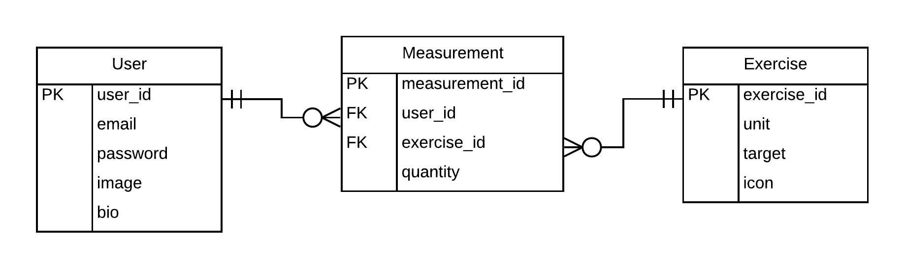

# Track my fitness API

## About

This is an API to provide the api endpoint for user to create an fitness app that can track their daily exercises.


The ER diagram used to create the model for this project is as below:



## Features

The features of this project are, user can:

1. register and login.
2. Perform CRUD operation for exercise.
3. Perform CRUD operation for measurements.
5. Get user information and update it.

## API Guide

### Authorization
Authorization is required for all endpoints except `/api/login` and `/api/register`.

1. **How to get the authorization token?**

To get the authorization token user should register using endpoint `/user`. If they have an account they can call the `/login` api to get the token.

2. **How the token should be passed?**

Once user have the token they can pass it on every request header as below:
```
Authorization: Token {user_token}
```

### API endpoints

Below is the information regarding api endpoint to use.
#### Login and Register

1. `/api/login`

    - Request verb: `POST`
    - Action: login
    - Request body parameters:
      ```
      {
        "user": {
          "email": "example@mail.com",
          "password": "test123"
        }
      }
      ```

    - Response:
      ```
      {
        "user": {
          "id": 1,
          "email": "example@mail.com",
          "bio": "user bio",
          "image": null,
          "token": "jwt_token"
        }
      }
      ```

1. `/api/register`

    - Request verb: `POST`
    - Action: Register
    - Request body parameters:
      ```
      {
          "user": {
            "email": "example@mail.com",
            "password": "test123"
          }
      }
      ```

    - Response:
      ```
      {
          "user": {
            "id": 1,
            "email": "example@mail.com",
            "bio": "user bio",
            "image": null,
            "token": "jwt_token"
          }
      }
      ```

#### End point for Exercise

1. `/api/exercises`

    - Request verb: `GET`
    - Action: Get all exercises
    - Request body parameters: `null`
    - Response:
      ```
      [
        {
          "id": 4,
          "name": "Pull up",
          "created_at": "2021-07-13T10:51:25.417Z",
          "updated_at": "2021-07-30T07:56:54.386Z",
          "unit": "reps",
          "target": 50,
          "icon": "pull-up"
        },
        {
          "id": 5,
          "name": "Running",
          "created_at": "2021-07-13T11:10:10.535Z",
          "updated_at": "2021-07-30T07:58:18.039Z",
          "unit": "KM",
          "target": 5,
          "icon": "runner"
        }
      ]
      ```

2. `/api/exercises`

    - Request verb: `POST`
    - Action: Creat new exercise
    - Request body parameters:
      ```
      {
        "exercise": {
          "name": "Push up",
          "unit": "reps",
          "target": 100
        }
      }
      ```
    - Response:
      ```
      {
        "id": 1,
        "name": "Push up",
        "created_at": "2021-08-06T09:45:13.058Z",
        "updated_at": "2021-08-06T09:45:13.058Z",
        "unit": "reps",
        "target": 100,
        "icon": "push-up"
      }
      ```

3. `/api/exercises/{exercise_id}`

    - Request verb: `PUT`
    - Action: Update exercise
    - Request body parameters:
      ```
      # from these fields which ever you want to update
      # you can pass that field or all if you want
      # to update all.
      {
        "exercise": {
          "name": "Push up",
          "unit": "reps",
          "target": 100,
          "icon": "icon-name"
        }
      }
      ```
    - Response:
      ```
      {
        "id": 1,
        "name": "Push up",
        "created_at": "2021-08-06T09:45:13.058Z",
        "updated_at": "2021-08-06T09:45:13.058Z",
        "unit": "reps",
        "target": 100,
        "icon": "icon-name"
      }
      ```

4. `/api/exercises/{exercise_id}`

    - Request verb: `DELETE`
    - Action: Delete exercise
    - Request body parameters: null
    - Response: null

5. `/api/exercises/{exercise_id}`

    - Request verb: `GET`
    - Action: Get exercise detail
    - Request body parameters: null
    - Response:
      ```
      {
        "id": 1,
        "name": "Push up",
        "created_at": "2021-08-06T09:45:13.058Z",
        "updated_at": "2021-08-06T09:45:13.058Z",
        "unit": "reps",
        "target": 100,
        "icon": "push-up"
      }
      ```

#### End point for Measurement

1. `/api/measurements`

    - Request verb: `GET`
    - Action: Get all measurements
    - Request body parameters: `null`
    - Response:
      ```
      [
        {
          "id": 2,
          "exercise_id": 3,
          "quantity": 60,
          "created_at": "2021-07-30T08:18:20.212Z",
          "updated_at": "2021-07-30T08:18:20.212Z",
          "user_id": 1
        },
        {
          "id": 3,
          "exercise_id": 3,
          "quantity": 1,
          "created_at": "2021-07-30T10:21:09.310Z",
          "updated_at": "2021-07-30T10:21:09.310Z",
          "user_id": 1
        }
      ]
      ```

2. `/api/measurements`

    - Request verb: `POST`
    - Action: Creat new measurement
    - Request body parameters:
      ```
      {
        "measurement": {
          "exercise_id": 3,
          "quantity": 60
        }
      }
      ```
    - Response:
      ```
      {
        "id": 1,
        "exercise_id": 3,
        "quantity": 60,
        "created_at": "2021-08-06T10:00:09.831Z",
        "updated_at": "2021-08-06T10:00:09.831Z",
        "user_id": 1
      }
      ```

3. `/api/measurements/{measurement_id}`

    - Request verb: `PUT`
    - Action: Update measurement
    - Request body parameters:
      ```
      {
        "measurement": {
          "quantity": "12"
        }
      }
      ```
    - Response:
      ```
      {
        "quantity": 12,
        "id": 1,
        "exercise_id": 3,
        "created_at": "2021-08-06T07:14:38.695Z",
        "updated_at": "2021-08-06T10:01:31.594Z",
        "user_id": 1
      }
      ```

4. `/api/measurements/{measurement_id}`

    - Request verb: `DELETE`
    - Action: Delete measurement
    - Request body parameters: null
    - Response: null

5. `/api/measurements/{measurement_id}`

    - Request verb: `GET`
    - Action: Get measurement detail
    - Request body parameters: null
    - Response:
      ```
      {
        "id": 1,
        "quantity": 12,
        "exercise_id": 3,
        "created_at": "2021-08-06T07:14:38.695Z",
        "updated_at": "2021-08-06T10:01:31.594Z",
        "user_id": 1
      }
      ```


#### End point for User

1. `/api/user`

    - Request verb: `GET`
    - Action: Get user detail
    - Request body parameters: null
    - Response:
      ```
      {
        "user": {
          "id": 1,
          "email": "example@mail.com",
          "bio": "user bio",
          "image": null,
          "token": "jwt_token"
        }
      }
      ```

5. `/api/user`

    - Request verb: `PUT`
    - Action: Update user details
    - Request body parameters:
      ```
      {
        "user": {
          "bio": "Updated bio."
        }
      }
      ```
    - Response:
      ```
      {
        "user": {
          "id": 1,
          "email": "example@mail.com",
          "bio": "Updated bio",
          "image": null,
          "token": "jwt_token"
        }
      }
      ```

## Live Demo

This project is hosted on heroku.

[Live demo link](https://twitter-design.herokuapp.com/)

## Built With

- Ruby
- Rails
- postgresql

## Getting Started

### Prerequisites

If you intend to download the project, you will need to have

1. Ruby

    For more information on how to install Ruby, follow [this link](https://www.ruby-lang.org/en/downloads/)

2. Ruby on rails

    After ruby is installed run cmd `gem  rails`

3. postgresql

    For installing postgresql [follow this link](http://postgresguide.com/setup/install.html)


### Installation instructions

Follow along the steps below to get a copy at your local machine.

- Navigate to the directory where you want this project to clone and then clone it

    ```
    git clone https://github.com/dipbazz/track-my-fitness.git
    ```

- Navigate to the `track-my-fitness` directory

    ```
    cd track-my-fitness
    ```

- install the gem package

    ```
    bundle install
    ```

- install npm packages
    ```
    npm install
    ```

- Create your database
    ```
    rails db:create
    ```

- Migrate the database

    ```
    rails db:migrate
    ```

- Start your server

    ```
    rails server
    ```

- Open browser at http://localhost:3000/

## Testing

To test the project run the below cmd from your project root directory.
```
rspec

OR

rspec --format doc
```


If you want to populate initial user data instead of creating it for manual testing you can run
```
rails db:seed
```
## Authors

👤 **Dipesh Bajgain**

- GitHub: [@dipbazz](https://github.com/dipbazz)
- Twitter: [@dipbazz](https://twitter.com/dipbazz)
- LinkedIn: [Dipesh Bajgain](https://www.linkedin.com/in/dipbazz/)

## 🤝 Contributing

Contributions, issues, and feature requests are welcome!

## Show your support

Give a ⭐️ if you like this project!

## 📝 License

This project is [MIT](./LICENSE) licensed.
